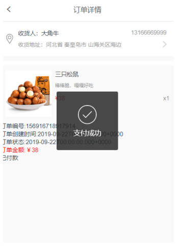

# happymarket-vue

vue开发的移动端H5超市在线购物平台

## Build Setup

``` bash
# install dependencies
npm install

# serve with hot reload at localhost:8081
npm run dev

# build for production with minification
npm run build

# build for production and view the bundle analyzer report
npm run build --report
```

For a detailed explanation on how things work, check out the [guide](http://vuejs-templates.github.io/webpack/) and [docs for vue-loader](http://vuejs.github.io/vue-loader).

### 技术栈
- **vue部分**：UI框架 Vue-ydui，图片懒加载 vue-lazyload，路由vue-router，网络请求axios，Vant UI 的 card组件，地址省市级 ydui-district，LocalStroage本地存储
- **后端**： springboot

### 目前具有功能：
1. **用户登录注册**
2. **搜索商品**
3. **分类:** 分类页面的每个一级分类下面有二级分类，二级分类下面会展示出商品
4. **购物车:** 目前如果购物车有很多商品，但只能购买一种，接口问题，待完善
5. **订单:** 支付订单，全部订单，订单详情
6. **地址:** 设置默认地址时只能在新建地址中选择默认地址或者费默认地址，地址列表里无法设置，定义接口的时候没考虑这一点，待完善
7. **收藏:** 搜藏的商品会在收藏列表里，只能在列表里删除收藏的商品，在购物车中连续点两下第二下并不会取消，也是前期确定接口时的bug

### 缺陷
大四刚开学就有一个20多天的实训，一边做一边想着秋招。这个项目两个人共同完成，一个写后端，我负责写前端，时间紧，做的时间只有10多天，本还有一个PC端用于商品管理，上传商品查看流水等
没有全部完成，目前这部分完全没考虑配送，物流，点击付款的时候只是将订单id传给后台，后台将订单状态变为1表示已付款，也没有调用
第三方应用支付宝微信这类的。做这个项目主要为了学习，进一步了解vue这方面的知识。

### 数据库
mysql数据库，数据库名称为happymarket，共有八张表

### 运行环境
- **后台：** tomcat localhost:8080
- **前端：**  webpack 3.6.0   node V10.16.2   vue 3.10.0  localhost:8081

### 页面展示

1. **分类页面**

	
	


2. **商品详情页面**

点击分类中的商品要进入到商品详情页面，在分类页面遍历商品的li标签下面加上
<router-link :to="{name:'GoodsDetail',query:{goods_id:item.goodsId}}">，
跳到商品详情页面并利用路由传值，将该商品的id传到详情页面中，展示对应商品，
在详情页面中可以将商品加入到购物车和收藏。收藏前需要登录。

  
	


3. **登录注册及本地存储**

用户未登录时在我的界面的头部显示登录注册按钮，点击登录注册按钮默认进入到登录界面。如果没有账号，在登录页面的下方点击立即注册可进入到注册页面。填写注册页面的信息，填写内容具有自动判断的功能，每项内容不能为空，手机号格式不正确也会有提示。

  
	 <br>
  
	


4. **设置地址**

使用VUE YDUI提供的工具ydui-district来完成地址功能可以直接完成省市县级联的操作。

  
	
  <br>
  
	


5. **购物车**

在商品详情页面点击加入购物车，可将商品加入到购物车中，并有提示，加入后点击购物车可直接进入到购物车页面查看对应商品

  
	

<br>
购物车中的商品可以进行加减数量，当数量是1的时候点击减少会提示是否删除，如果是，
就将商品从购物车中删除，若点否，则仍保存在购物车中

  
	


6. **下订单**
在购物车中点击去结算跳到支付订单页面，并把商品id和商品数量传过来，在订单页面中默认获取默认地址的id，在订单页面中点击支付，如果成功调用后端支付接口，会将该订单状态从0变成1，
并直接跳到订单详情页面，如果支付失败，则停留在该页面。支付成功后可在我的订单中查看订单状态。

  
	
  <br>
  
	
  


7. **收藏**

在商品详情中点击左下角的收藏按钮可收藏商品，点击首页的收藏导航进入到我的收藏页面，可以在这地点击商品直接进入到商品详情界面，也可删除收藏的商品。

  
	
  

### 个人总结
时间仓促，赶着校招的，还有好多功能需要完善，但通过完成这些基本的操作对vue更熟悉一些。
